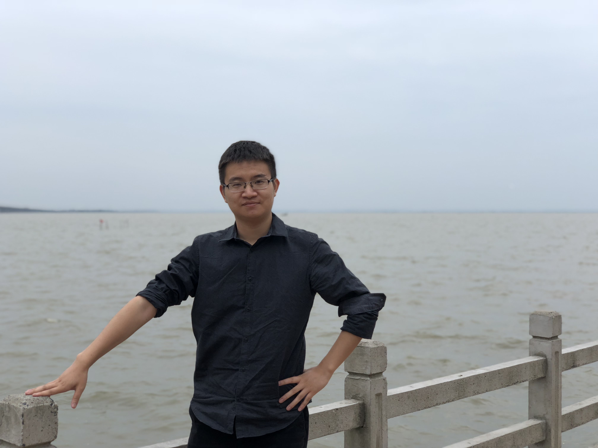

   
   

 
Shaodong Wang (王邵东) 

 
   
  

 

Address:	School of Mathematics and Statistics,  
Nanjing University of Science and Technology,  
Nanjing  
E-mail:	shaodong.wang@mail.mcgill.ca

## Short Vitae

- Associate Professor at Nanjing University of Science and Technology, since 2023
- Wu Wen-Tsun Assistant Professor at Shanghai Jiao Tong University, 2019-2023
- PhD, McGill University, Canada, 2019
- Bachelor, University of Science and Technology, China, 2014

## Research interest

- Nonlinear Partial Differential Equations
- Geometric Analysis

## Publications

- (with S. Almaraz) Energy bounds of sign-changing solutions to Yamabe equations on manifolds with boundary, _Nonlinear Anal._, 225 (2022), Paper No. 113131, 12 pp.([link](https://arxiv.org/pdf/2205.06588.pdf))
- (with J. Vetois) Infinitely many solutions for cubic nonlinear Schrödinger equations in dimension four, _Adv. Nonlinear Anal._, 8 (2019), no.1, 715-724.([link](https://www.degruyter.com/document/doi/10.1515/anona-2017-0085/html))

  
